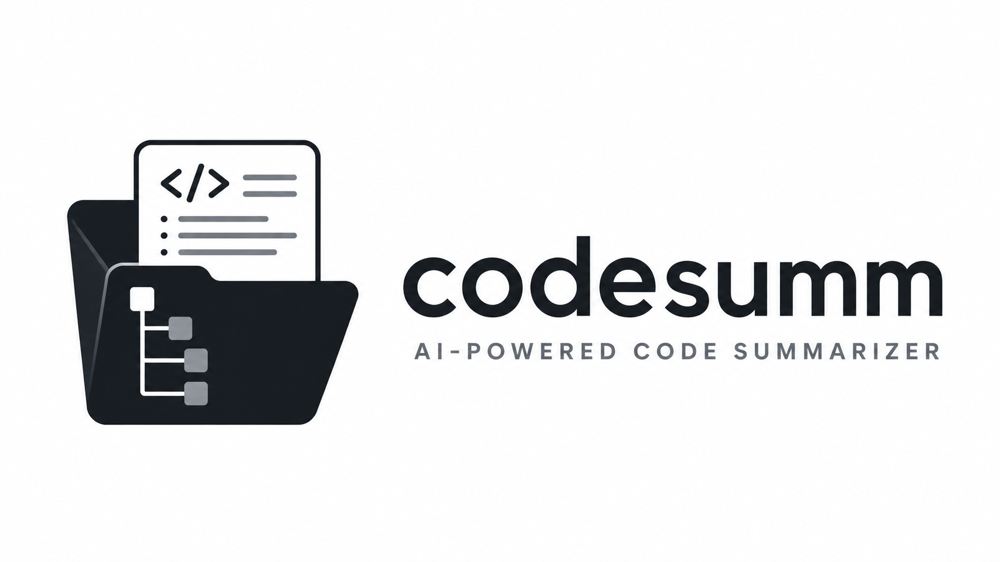

<p align="center">
  
</p>

# codesumm

AI-powered code summarizer that generates a `summary.md` for every folder in your repository. Uses an LLM to understand your codebase and produce structured, human-readable summaries so that new contributors (and future you) can navigate the project without reading every file.

## Features

- **Bottom-up DFS traversal** — summarizes leaf folders first, then incorporates child summaries into parent folders
- **Context-aware** — reads your README and architecture docs to understand the project before summarizing
- **`.gitignore`-style exclusions** — skip `node_modules`, `.git`, `dist`, and anything else via `--exclude` option or from `create config.yaml` in root of repository. Can get structure for this config below.
- **Context window management** — automatically batches large folders to fit within model limits
- **Rate limit handling** — exponential backoff on 429 responses
- **Works with any OpenAI-compatible API** — OpenRouter, OpenAI, local models, anything with a `/v1/chat/completions` endpoint

## Installation

```bash
pip install codesumm
```

## Quick Start

1. Set your API key:

```bash
export LLM_API_KEY=sk-your-key-here
export LLM_BASE_URL=https://openrouter.ai/api/v1
export LLM_MODEL=openai/gpt-4o
```

Or create a `.env` file in your repo root with the same variables.

2. Run it:

```bash
codesumm ./your-repo
```

3. Find your summaries in `./your-repo/.summaries/`, mirroring your repo structure.

## Example Output

```
your-repo/
  src/
    auth/
    utils/
  .summaries/
    summary.md            ← root summary
    src/
      summary.md          ← summary for /src
      auth/
        summary.md        ← summary for /src/auth
      utils/
        summary.md        ← summary for /src/utils
```

Each `summary.md` follows a standard format:

```markdown
# auth

## Purpose

Handles user authentication and session management.

## Key Components

- `jwt.py` — JWT token generation and validation
- `middleware.py` — Express middleware for route protection
- `providers/` — OAuth provider integrations (Google, GitHub)

## Internal Dependencies

Depends on `src/db/repositories/user.py` for user lookups.

## Notes

Token expiry is configured via AUTH_TOKEN_TTL environment variable.
```

## Configuration

Create a `config.yaml` in your repo root to customize behavior:

```yaml
exclude:
  - node_modules/
  - .git/
  - dist/
  - __pycache__/
  - "*.pyc"
  - "*.lock"

supported_extensions:
  - .py
  - .js
  - .ts
  - .go
  - .java
  - .rs
  - .yaml
  - .json
  - .sh

output_dir: .summaries

rate_limit:
  base_delay_seconds: 1
  max_retries: 5

context_reserve_ratio: 0.3
```

If no config file is found, sensible defaults are used.

## CLI Options

```
codesumm <repo_path> [options]

Options:
  --config PATH       Path to config.yaml
  --output-dir NAME   Override output directory (default: .summaries)
  --model MODEL       Override LLM model
  --exclude           Exclude pattern
  --base-url URL      Override LLM API base URL
  --verbose           Enable debug logging
  --version           Show version
  --help              Show help
```

## How It Works

```
1. Read README / architecture docs at repo root
2. Build a file tree (depth=2) for project overview
3. DFS into each folder:
   a. Read all code files in the folder
   b. Generate a scope hint (1-2 line purpose description)
   c. Summarize all files in one LLM call
   d. Recurse into subfolders, passing scope hint as parent context
   e. Combine file summary + child summaries into final folder summary
   f. Write summary.md to .summaries/
4. Done.
```

## Requirements

- Python 3.10+
- An API key for any OpenAI-compatible LLM provider

## License

MIT

## Future Additions

- [ ] Context limit of model can be set in config and CLI Arguments.
- [ ] Summarize only for specific branch.
